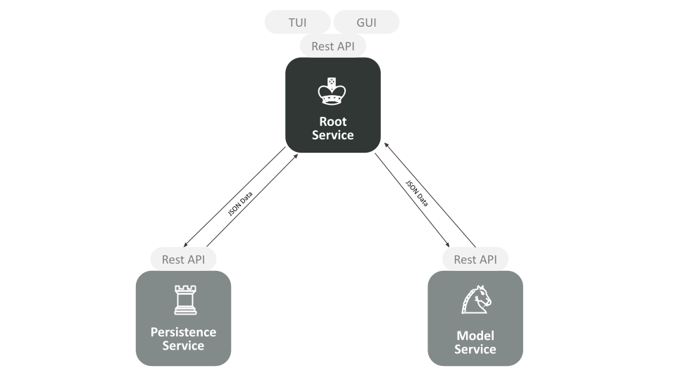

# Schach

### Game Project for the Software Architecture class in AIN5 at HTWG

The game is using the common chess rules. If you want to know more about those click [here](https://en.wikipedia.org/wiki/Rules_of_chess).  

### Check out the Documentation of our Game(-Logic) [here](https://benjaminbruenau.github.io/Schach-Docs/Schach/model/gameFieldComponent/gameFieldBaseImpl/index.html)

# Usage 

The easiest way to start the Game locally, after cloning the repository, would be to start the **Persistence** and **Model** Service
via their respective Docker Containers (located in the [docker-compose.yml](docker-compose.yml))
and by then starting the [Main Method](src/main/scala/Schach/Schach.scala) 
of the Root Service to gain easy access towards the **Text**-and **Graphical** _User Interface_.

(Alternatively the Root Service can be used through its Docker Container by either setting the Display Variable in the compose file 
correctly to connect with the GUI or using the REST Interface via its paths)

# Architecture

The **[Root Service](src)** is the core of the Game, containing 
the _User Interfaces_ as well as the Games _Controller_.

The **[Model Service](Model)** defines the GameField Model and Rules, but is also responsible for
maintaining and updating the instance of the current Game.

The **[Persistence Service](Persistence)** is providing the option to persistently save
and load a specific Game State (or Game **States** in the case of _MongoDB_ / _Slick_). 

While running the Application and interacting with the **Root Service** to play the game, it will communicate with the other
two Services via _HTTP_ and _REST_ APIs by exchanging **JSON** Data.

# Tests

The **Unit**-Tests (_src/test_) can be run locally without further requirements thanks to our Mock Implementations.

The **Integration**-Tests (_src/it_) need to be run with a Docker Service available (e.g. Docker Desktop), since we make heavy use 
of [Testcontainers for Scala](https://github.com/testcontainers/testcontainers-scala) to provide a Database and needed Micro Services 
for these Tests.

The [Performance Tests](Gatling) can be run individually (after starting up the required Services)
by exchanging the needed Test Class in our [Gatling Runner](Gatling/src/test/scala/gatling/GatlingRunner.scala)

